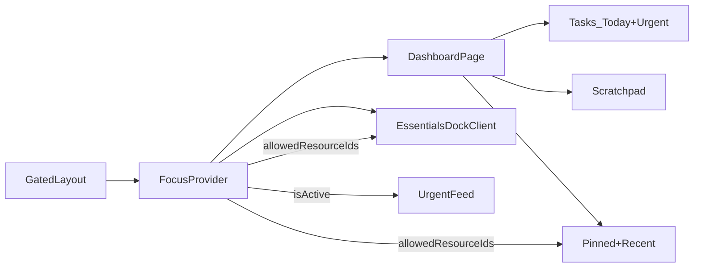

# Deep plan: extend Cerna into a solo work workflow

## Conversation summary (full context)

### Product intent

- You want Cerna to become a **web workflow hub**: easy, customizable, fast, and calm.
- Core outcomes:
- **One main dashboard** where users can work without juggling many tabs.
- **Read-only urgent feed** (fast to ship) with **redirect/open in source**.
- **Resource library** organized with **simple categories** for now.
- A lightweight **Pomodoro/Focus (Zen) mode** that reduces distraction inside Cerna by filtering what is shown.

### Decisions we made together

- **Target user**: solo-first (not a B2B/team product). “Small team later” should remain possible, but not in MVP.
- **Tasks source of truth**: Cerna owns tasks/goals; integrations are informational (read-only).
- **Organization strategy**:
- Long-term you prefer **strict separation** (work vs side project). We’ll model this as **Spaces** later.
- For the MVP: keep the existing **categories** model for resources; no section→category hierarchy yet.
- **Urgent feed**: ship **read-only** (low risk), each item has one obvious CTA (“Open”).
- **Focus mode intent**: minimal-impact; not heavy blocking. It should help users keep “needed resources” visible and hide the rest.
- **MVP storage**: confirmed **Supabase DB** (persistent across devices).
- **Focus filtering scope**: confirmed **Dashboard + Essentials dock** (not just dashboard).

### Existing repo constraints/opportunities we found

- Cerna already has a gated app shell and a `Dashboard` route:
- Dashboard currently shows **Pinned** and **Recent** resources.
- There is a top **Essentials dock** rendered in the gated layout.
- Resource “open” already routes via `/app/out/:id` (good redirect primitive).
- Server-side patterns already exist:
- `lib/db/*` modules using `unstable_cache` + tag revalidation.
- Server actions in `features/*/actions.ts`.
- Consistent microcopy and pending-state submit buttons.

## MVP definition (what we will build now)

### The MVP experience

A calm 3-column dashboard inside `/app`:

- **Column 1: Today**
- Task list (Today + due soon)
- Quick add task
- Mark done/undo
- **Column 2: Focus**
- Pomodoro timer
- “Allowed resources” selection (what stays visible)
- Focus state filters urgent feed + resources + essentials dock
- After-focus summary (minimal)
- **Column 3: Library + Scratchpad**
- Pinned resources
- Recent resources
- Scratchpad note (fast capture, autosave)

### What we explicitly defer

- External integrations (Google Calendar/Asana/etc.)
- Goals/roadmap system
- Heavy analytics dashboards
- Teams/collaboration
- Two-level resource taxonomy (Section → Category)

## Architecture and boundaries

### Data boundaries

- MVP is single-user, but modeled so it can evolve.
- In MVP we add:
- **Tasks**: a small, boring task model sufficient for Today + urgent.
- **Scratchpad**: single per-user row.
- Later we add:
- **Spaces**: strict separation boundary for tasks/resources/notes/feed.
- **FeedItem**: normalized feed items from tasks + integrations.

### State boundaries

- Server-rendered data: tasks/resources/scratchpad
- Client state: focus timer + focus allow-list
- Goal: avoid putting business logic in onClick handlers; use named functions.

## Data model (Supabase)

Add migration file:

- [`supabase/migrations/0008_tasks_and_scratchpad.sql`](/Users/bohdan.kolesnik/Desktop/cerna/supabase/migrations/0008_tasks_and_scratchpad.sql)

### Table: `tasks`

- Columns:
- `id uuid pk default gen_random_uuid()`
- `user_id uuid not null references auth.users`
- `title text not null`
- `notes text null`
- `status text not null default 'open' check in ('open','done')`
- `due_at timestamptz null`
- `done_at timestamptz null`
- `created_at timestamptz default now()`
- `updated_at timestamptz default now()`
- Indexes:
- `(user_id)`
- `(user_id, status, due_at)`
- RLS:
- select own
- write with entitlement using `public.has_active_entitlement(user_id)` (consistent with `resources`)
- Trigger:
- `set_updated_at` (reuse existing `public.set_updated_at()`)

### Table: `scratchpads`

- Columns:
- `user_id uuid pk references auth.users`
- `content text not null default ''`
- `created_at`, `updated_at`
- RLS:
- select own
- write with entitlement
- Trigger:
- `set_updated_at`

## Server layer (db modules + caching + actions)

### Cache tags

Update [`lib/cache/tags.ts`](/Users/bohdan.kolesnik/Desktop/cerna/lib/cache/tags.ts):

- Add `tasksTag(userId)`
- Add `scratchpadTag(userId)`

### DB modules

Add:

- [`lib/db/tasks.ts`](/Users/bohdan.kolesnik/Desktop/cerna/lib/db/tasks.ts)
- `listTasks({ userId, scope })` where scope is:
    - `today`: due today (and optionally created today with no due) to avoid empty screens
    - `urgent`: overdue or due within 24h (simple time-based rule)
    - `open`: all open tasks
- `createTask({ userId, title, dueAt? })`
- `setTaskDone({ userId, taskId, isDone })`
- Use `unstable_cache` + `tasksTag(userId)`
- [`lib/db/scratchpad.ts`](/Users/bohdan.kolesnik/Desktop/cerna/lib/db/scratchpad.ts)
- `getScratchpad(userId)` (return null if missing)
- `upsertScratchpad({ userId, content })`
- Use `unstable_cache` + `scratchpadTag(userId)`

### Server actions

Add:

- [`features/tasks/actions.ts`](/Users/bohdan.kolesnik/Desktop/cerna/features/tasks/actions.ts)
- `createTaskAction(prev, formData)` returns `{ok,message?}`
- `toggleTaskDoneAction(taskId, formData)` (server action, revalidate `tasksTag`)
- [`features/scratchpad/actions.ts`](/Users/bohdan.kolesnik/Desktop/cerna/features/scratchpad/actions.ts)
- `saveScratchpadAction(prev, formData)` (revalidate `scratchpadTag`)

Design notes:

- Microcopy: short/direct (“Couldn’t save. Try again.”)
- Prevent double-submit by reusing `FormSubmitButton` patterns.

## UI plan (dashboard + components)

### 1) Refactor dashboard into 3 columns

Update:

- `[app/(app)/app/(gated)/page.tsx](/Users/bohdan.kolesnik/Desktop/cerna/app/\\(app)/app/(gated)/page.tsx)`

Server fetches (parallel):

- `listTasks(today)`
- `listTasks(urgent)`
- `getScratchpad()`
- existing `listResources(pinned)` and `listResources(recent)`

UI rendering:

- Maintain the current page header (“Dashboard”).
- Replace the current vertical layout with a **3-column grid** (stack on mobile).

### 2) Task UI components

Add:

- `features/tasks/components/today-tasks.tsx`
- List tasks with checkbox forms for done/undo
- Empty state: “No tasks for today.”
- `features/tasks/components/task-quick-add.tsx`
- Single input + submit button with pending state
- Keyboard: Enter submits; Escape clears

### 3) Urgent feed (internal v1)

Add:

- `features/feed/components/urgent-feed.tsx`
- Normalize `urgentTasks` into feed rows.
- Each row shows: title + timing label (overdue / due soon) + one CTA.
- CTA behavior for v1: scroll to Today list or open future task detail route.

### 4) Scratchpad (autosave with explicit states)

Add:

- `features/scratchpad/components/scratchpad.tsx`
- `Textarea` with debounced save
- Visible state line: “Saving…” / “Saved” / “Couldn’t save”
- Prevent race conditions: keep last-saved timestamp/etag in state

## Focus/Zen mode plan (dashboard + essentials dock)

### Why we need a provider

- Essentials dock is rendered from a server component (`components/app/essentials-dock.tsx`), but the dock UI itself is a client component (`EssentialsDockClient`).
- Focus state must therefore be **client-global** so both Dashboard and Dock can read it.

### Focus provider

Add:

- `components/app/focus/focus-provider.tsx`
- Stores:
    - `isActive`
    - `endsAt`
    - `allowedResourceIds: string[]`
    - `mode: 'focus' | 'zen'` (optional, but future-proof)
- Persists to `localStorage` so refresh doesn’t break the session.
- Exposes named functions: `enterFocus`, `exitFocus`, `toggleAllowedResource`, etc.

### Wire provider into gated layout

Update:

- `[app/(app)/app/(gated)/layout.tsx](/Users/bohdan.kolesnik/Desktop/cerna/app/\\(app)/app/(gated)/layout.tsx)`
- Keep server checks (`requireServerUser`, `requireActiveEntitlement`).
- Wrap children and dock in a small client wrapper that renders `FocusProvider`.

### Focus panel UI

Add:

- `components/app/focus/focus-panel.tsx`
- Timer presets: 25/50/custom
- Start/Stop
- Allowed resources selection: pick from essentials + pinned + recent
- During focus:
    - urgent feed is filtered to ASAP (overdue/due soon)
    - resources lists show only allowed resources

### Filter essentials dock during focus

Update:

- [`components/app/essentials-dock-client.tsx`](/Users/bohdan.kolesnik/Desktop/cerna/components/app/essentials-dock-client.tsx)
- Read focus context
- If active: filter `essentials` down to `allowedResourceIds`.
- Ensure empty state is clear: “Focus mode is on. No essentials allowed yet.” with a hint to adjust.

## UX requirements checklist (your rules)

- No business logic in UI handlers; handlers call named functions.
- Prevent double submits; show pending state.
- Clear states: loading/empty/error/success.
- Confirm destructive actions (not heavily used in this MVP, but keep patterns).
- Accessibility: keyboard support, focus states, semantic controls.
- Minimal motion.

## Future roadmap (post-MVP)

### Spaces (strict separation)

- Add `spaces` table and add `space_id` to tasks/resources/notes/feed.
- UI: space switcher in sidebar; default space on first run.

### Integrations (read-only urgent feed)

- Add `integration_connections` + `feed_items`.
- Start with Google Calendar read-only feed items.
- Urgent feed becomes: `internal urgent tasks + external feed items`.

## Implementation sequence

1. Add migration for tasks + scratchpad.
2. Add cache tags + db modules + server actions.
3. Refactor dashboard into 3-column layout + task list + urgent feed + scratchpad.
4. Add focus provider + focus panel; wire filtering into dashboard and essentials dock.

## Diagrams

